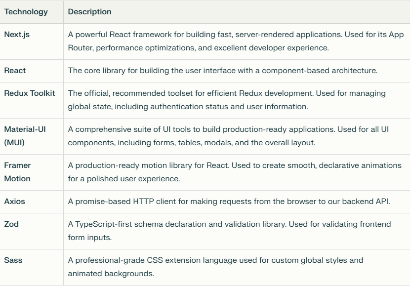
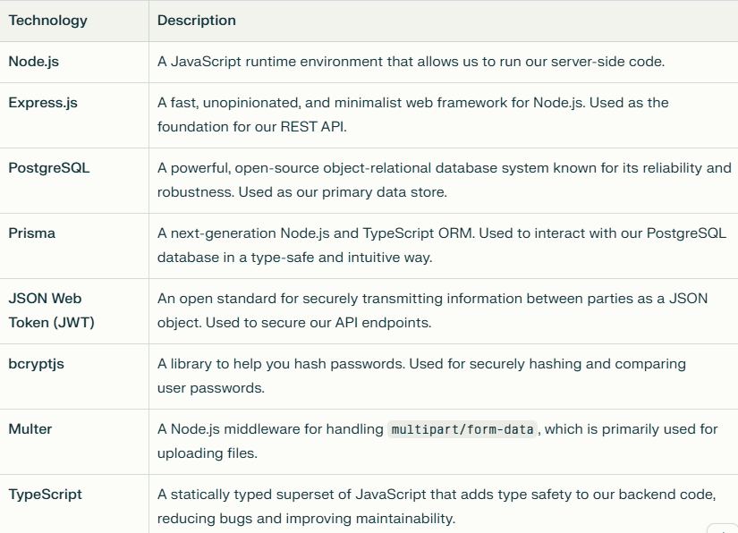
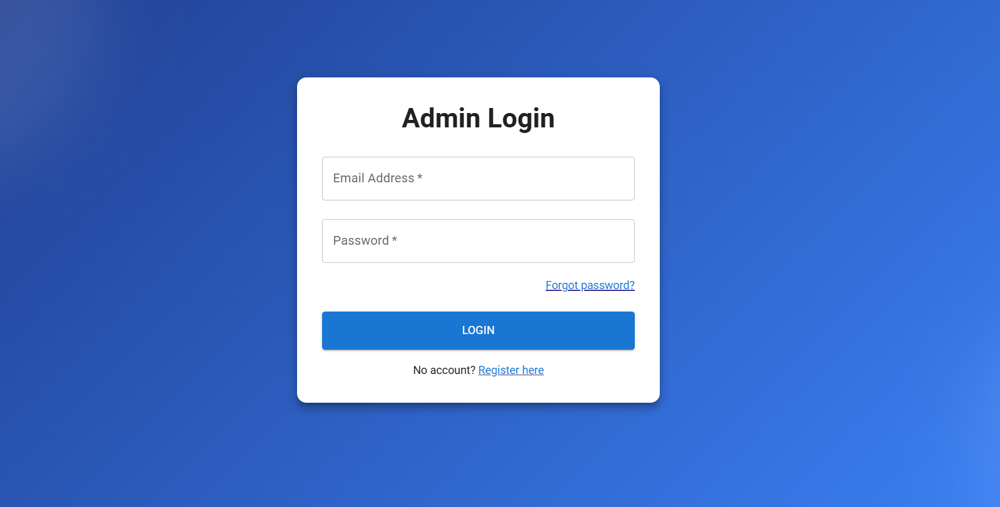
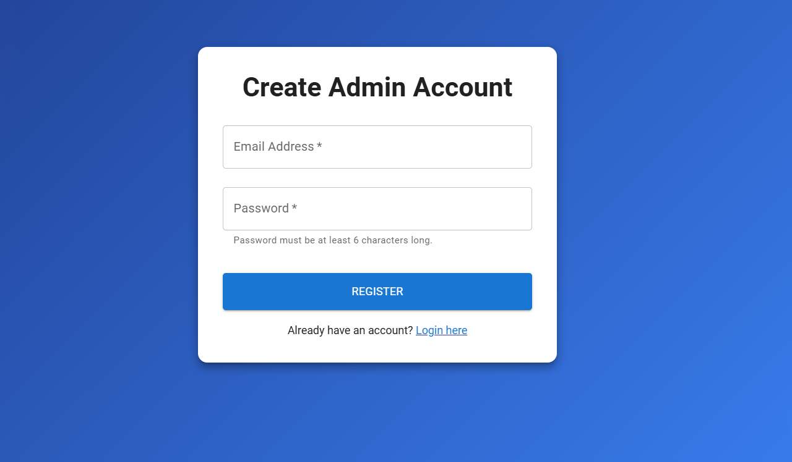
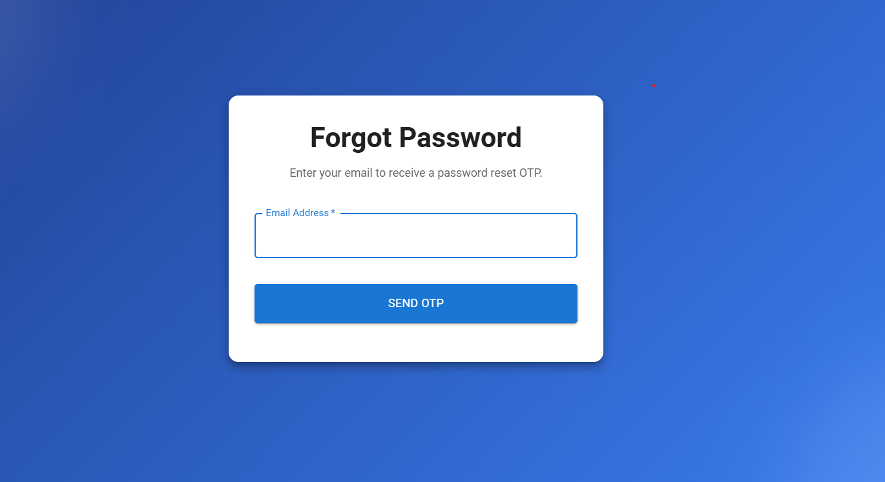
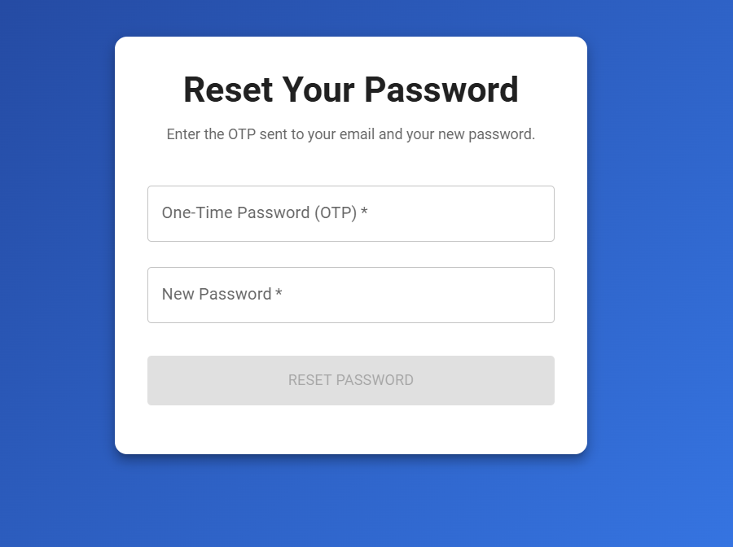
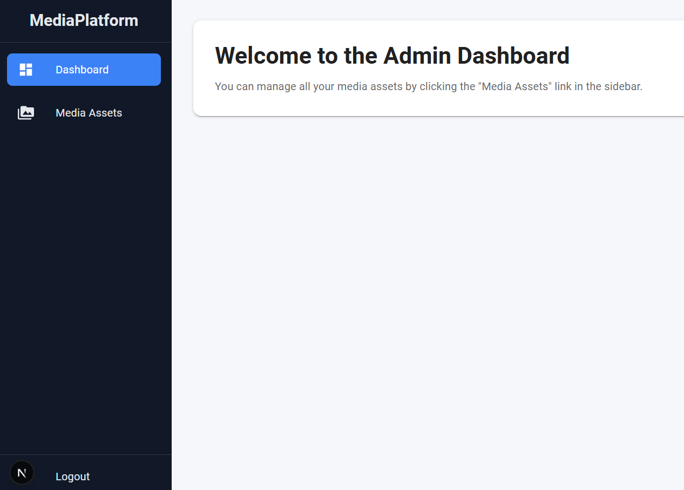
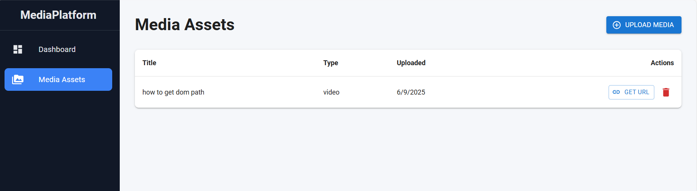

Media Platform - A Secure Media Hosting & Streaming Service
This is a full-stack application designed to provide a secure and robust platform for uploading, managing, and streaming media content. It features a modern, responsive frontend built with Next.js and Material-UI, and a powerful backend powered by Node.js, Express, and PostgreSQL.

Features
Secure User Authentication: Complete authentication flow including registration, login, and password reset (forgot/reset password).

JWT-Based Security: Backend routes are protected using JSON Web Tokens, ensuring that only authenticated users can access and manage their media.

Media Upload & Management: Users can upload new media assets, view a list of all their assets, and delete them.

Secure, Temporary Streaming URLs: Generate time-sensitive, secure links to stream media content, preventing unauthorized access.

Professional UI/UX: A sleek, modern, and fully responsive user interface built with Material-UI, featuring smooth animations and a professional design system.

Robust Backend Architecture: A clear and scalable backend with a service-oriented architecture, validation middleware, and centralized error handling.

Tech Stack

Frontend

Backend

Application Screenshots
Authentication Flow
 
 

Admin Dashboard & Media Management
 

Authentication (/auth)
POST /auth/signup: Register a new admin user.

POST /auth/login: Log in an admin user and receive a JWT.

POST /auth/logout: Log out the user and clear the session.

POST /auth/forgot-password: Send a password reset OTP to the user's email.

POST /auth/reset-password: Reset the user's password using the OTP.

Media (/media)
All media routes are protected and require a valid JWT.

GET /media: Get a list of all media assets uploaded by the authenticated user.

POST /media/upload: Upload a new media file.

GET /media/:id/stream-url: Generate a secure, temporary streaming URL for a media asset.

DELETE /media/:id: Delete a media asset.

GET /media/stream/:token: (Public, token-based) Endpoint to stream media content.